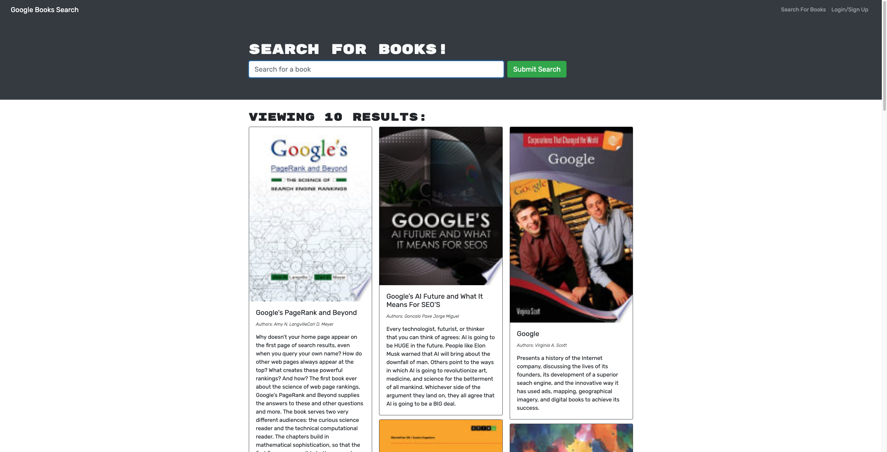
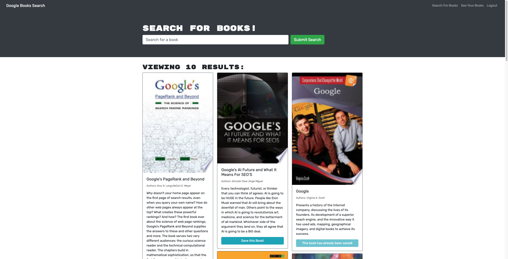

# Book-Search-Engine-New

## Build a fully functioning Google Books API search engine built with a RESTful API, and refactor it to be a GraphQL API built with Apollo Server. The app was built using the MERN stack, with a React front end, MongoDB database, and Node.js/Express.js server and API. It's already set up to allow users to save book searches to the back end.

## Live App

https://tranquil-refuge-23529.herokuapp.com/

## Screnshots

### A user can type a search term in a search box and the results appear (Not log in yet):



### Login/SignUp Page


### The user can save books by clicking "Save This Book!" under each search result after logged in:



### A user can view their saved books on a separate page:


## Instruction

```text
Step 1: Go to the root deirectory of this repo in terminal and type:

npm install

Step 2: run the app by typing:

npm Start

Step 3: Open your browser and enter: http://localhost:3000/
```
